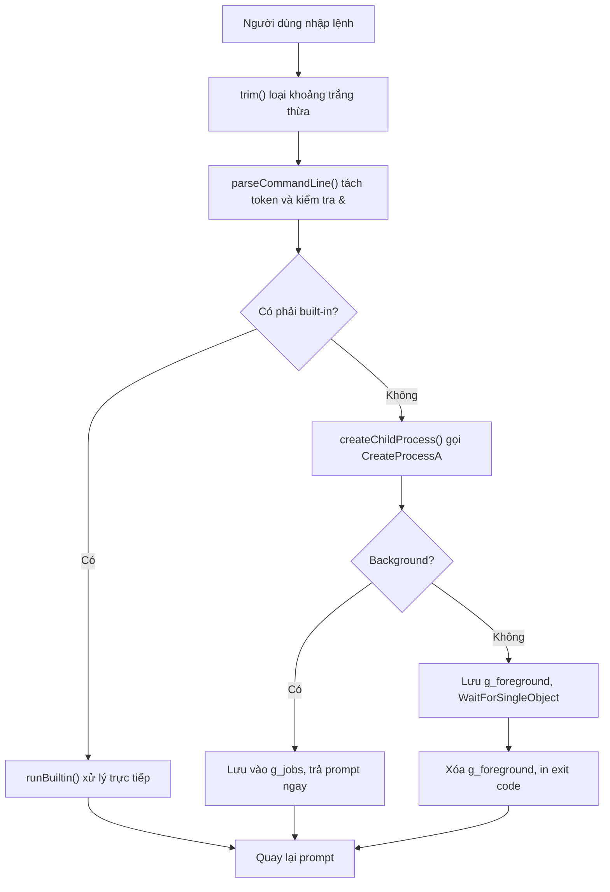

# Báo Cáo Bài Tập Lớn Môn Nguyên Lý Hệ Điều Hành

## Đề tài: Thiết kế và cài đặt một Tiny Shell trên Windows

**Tên shell:** `myShell`  
**Ngôn ngữ:** C++17  
**Nền tảng:** Windows 10/11  
**API hệ điều hành chính:** Windows Process API, ToolHelp API, Console Control Handler, Environment API  
**File mã nguồn chính:** `src/main.cpp`

> Ghi chú: phần thông tin nhóm, lớp, giảng viên có thể bổ sung trực tiếp tại đây trước khi nộp.

---

## Mục Lục

1. Mở đầu
2. Cơ sở lý thuyết
3. Yêu cầu bài toán
4. Thiết kế hệ thống
5. Cài đặt các chức năng chính
6. Các chức năng mở rộng
7. Kết quả biên dịch và kiểm thử
8. Hạn chế
9. Hướng phát triển
10. Kết luận

---

## 1. Mở đầu

Shell là chương trình trung gian giữa người dùng và hệ điều hành. Người dùng nhập lệnh ở dạng văn bản, shell phân tích lệnh đó, sau đó yêu cầu hệ điều hành thực hiện công việc tương ứng. Với hệ điều hành Windows, các shell quen thuộc là `cmd.exe` và PowerShell.

Đề tài Tiny Shell yêu cầu xây dựng một shell đơn giản để hiểu rõ hơn các vấn đề cốt lõi của môn Nguyên lý hệ điều hành: tạo tiến trình, chờ tiến trình, chạy tiến trình nền, quản lý PID, tạm dừng/tiếp tục tiến trình, xử lý Ctrl+C và thao tác biến môi trường.

Project này hiện thực một shell tên `myShell`, chạy trên Windows, sử dụng C++17 và các API hệ thống của Windows.

---

## 2. Cơ sở lý thuyết

### 2.1. Shell và vòng lặp REPL

Một shell cơ bản thường hoạt động theo vòng lặp:

1. **Read:** đọc lệnh người dùng nhập.
2. **Parse:** tách lệnh thành tên lệnh, đối số, cờ chạy nền.
3. **Evaluate:** xác định lệnh là built-in hay chương trình bên ngoài.
4. **Execute:** chạy built-in trực tiếp hoặc tạo tiến trình con.
5. **Print:** in kết quả, prompt mới hoặc thông báo lỗi.

Trong project, vòng lặp này nằm trong hàm `main()` ở `src/main.cpp`, dòng 1149-1185.

### 2.2. Tiến trình foreground và background

**Foreground process** là tiến trình shell phải đợi kết thúc. Ví dụ:

```text
notepad
```

Khi chạy foreground, shell gọi `CreateProcessA()`, lưu tiến trình hiện tại vào `g_foreground`, rồi gọi `WaitForSingleObject()` để chờ tiến trình kết thúc.

**Background process** là tiến trình chạy song song với shell. Người dùng thêm `&` cuối lệnh:

```text
ping -n 10 127.0.0.1 > nul &
```

Shell tạo tiến trình con nhưng không chờ. Thay vào đó shell lưu PID, handle, lệnh gốc và trạng thái vào danh sách `g_jobs`.

### 2.3. Các Windows API quan trọng

| API | Vai trò trong project |
| --- | --- |
| `CreateProcessA()` | Tạo tiến trình con từ dòng lệnh người dùng nhập. |
| `WaitForSingleObject()` | Chờ tiến trình foreground kết thúc hoặc chờ ngắn sau khi kill. |
| `GetExitCodeProcess()` | Kiểm tra tiến trình còn chạy hay đã thoát. |
| `TerminateProcess()` | Kết thúc tiến trình khi dùng `kill`, Ctrl+C hoặc thoát shell. |
| `CreateToolhelp32Snapshot()` | Chụp danh sách thread để tìm thread thuộc một PID. |
| `Thread32First()` / `Thread32Next()` | Duyệt các thread trong snapshot. |
| `SuspendThread()` | Tạm dừng thread, dùng cho lệnh `stop`. |
| `ResumeThread()` | Tiếp tục thread, dùng cho lệnh `resume`. |
| `SetConsoleCtrlHandler()` | Bắt Ctrl+C để ngắt foreground process thay vì tắt shell. |
| `GetEnvironmentVariableA()` | Đọc biến môi trường, nhất là `PATH`. |
| `SetEnvironmentVariableA()` | Cập nhật biến môi trường trong phiên shell hiện tại. |
| `InitializeCriticalSection()` | Tạo vùng bảo vệ dữ liệu dùng chung như `g_jobs`, `g_foreground`. |

---

## 3. Yêu cầu bài toán

Theo ảnh yêu cầu và tài liệu tham khảo, Tiny Shell cần có:

| Nhóm yêu cầu | Trạng thái |
| --- | --- |
| Nhận lệnh từ người dùng | Đã cài đặt |
| Phân tích lệnh | Đã cài đặt |
| Tạo tiến trình con | Đã cài đặt bằng `CreateProcessA()` |
| Chạy foreground và chờ kết thúc | Đã cài đặt |
| Chạy background bằng ký tự `&` | Đã cài đặt |
| `list`: in PID, command, status | Đã cài đặt |
| `kill <pid>` | Đã cài đặt |
| `stop <pid>` | Đã cài đặt bằng `SuspendThread()` |
| `resume <pid>` | Đã cài đặt bằng `ResumeThread()` |
| Built-in `exit`, `help`, `date`, `time`, `dir` | Đã cài đặt |
| `path`, `addpath` | Đã cài đặt |
| Ctrl+C hủy foreground process | Đã cài đặt |
| Chạy file `.bat` | Đã cài đặt qua `cmd.exe /C` |

---

## 4. Thiết kế hệ thống

### 4.1. Cấu trúc project

```text
Tiny Shell/
├── CMakeLists.txt
├── README.md
├── src/
│   └── main.cpp
├── scripts/
│   ├── demo.tsh
│   └── hello.bat
└── docs/
    ├── bao_cao_tiny_shell.md
    └── huong_dan_chi_tiet_cho_nguoi_moi.md
```

### 4.2. Các thành phần chính

| Thành phần | File/dòng | Vai trò |
| --- | --- | --- |
| `ParsedCommand` | `src/main.cpp`, dòng 28-33 | Lưu dòng lệnh đã parse, token và cờ background. |
| `BackgroundJob` | dòng 35-43 | Lưu PID, handle, command, trạng thái và exit code của tiến trình nền. |
| `ForegroundProcess` | dòng 45-50 | Lưu foreground process hiện tại để Ctrl+C có thể hủy đúng tiến trình. |
| Parser | dòng 58-187 | Cắt khoảng trắng, tách token, nhận diện `&`. |
| Environment Manager | dòng 191-220, 780-894 | Đọc/ghi PATH và biến môi trường. |
| Process Manager | dòng 249-680 | Tạo, liệt kê, kill, stop, resume tiến trình. |
| Built-in command dispatcher | dòng 978-1104 | Điều phối các lệnh built-in. |
| Shell loop | dòng 1149-1185 | Vòng lặp chính của shell. |

### 4.3. Luồng xử lý một lệnh



---

## 5. Cài đặt các chức năng chính

### 5.1. Phân tích lệnh

`parseCommandLine()` nhận chuỗi người dùng nhập, loại khoảng trắng thừa, phát hiện `&` ở cuối lệnh và gọi `tokenize()` để tách thành các token.

Ví dụ:

```text
ping -n 10 127.0.0.1 > nul &
```

được hiểu là:

| Trường | Giá trị |
| --- | --- |
| `raw` | `ping -n 10 127.0.0.1 > nul` |
| `tokens` | `ping`, `-n`, `10`, `127.0.0.1`, `>`, `nul` |
| `background` | `true` |

### 5.2. Chạy foreground

Khi lệnh không có `&`, shell:

1. Gọi `CreateProcessA()` để tạo tiến trình con.
2. Lưu handle và PID vào `g_foreground`.
3. Gọi `WaitForSingleObject()` với `INFINITE`.
4. Lấy exit code bằng `GetExitCodeProcess()`.
5. Đóng handle bằng `CloseHandle()`.

### 5.3. Chạy background

Khi lệnh có `&`, shell:

1. Tạo tiến trình con bằng `CreateProcessA()`.
2. Không gọi `WaitForSingleObject()` để chờ tiến trình.
3. Lưu tiến trình vào `g_jobs`.
4. In PID cho người dùng.
5. Quay lại prompt ngay.

### 5.4. Lệnh `list`

`listBackgroundJobs()` gọi `refreshBackgroundJobs()` để cập nhật trạng thái trước khi in. Mỗi job có các trạng thái:

- `Running`
- `Suspended`
- `Exited(<exitCode>)`

### 5.5. Lệnh `kill`

`kill <pid>` mở tiến trình bằng `OpenProcess()`, sau đó gọi `TerminateProcess()`. Nếu PID thuộc danh sách background của shell, trạng thái được cập nhật thành `Exited(1)`.

### 5.6. Lệnh `stop` và `resume`

Windows không có một hàm đơn giản kiểu `SuspendProcess()`, nên shell phải:

1. Gọi `CreateToolhelp32Snapshot(TH32CS_SNAPTHREAD, 0)` để lấy toàn bộ thread trong hệ thống.
2. Duyệt từng thread.
3. Chọn thread có `th32OwnerProcessID == pid`.
4. Gọi `SuspendThread()` hoặc `ResumeThread()`.

### 5.7. Ctrl+C

Shell đăng ký `consoleControlHandler()` bằng `SetConsoleCtrlHandler()`. Khi người dùng nhấn Ctrl+C:

- Nếu có foreground process: shell gọi `TerminateProcess()` trên foreground process đó.
- Nếu không có foreground process: shell không thoát, chỉ in gợi ý dùng `exit`.

### 5.8. Chạy `.bat`

File `.bat` và `.cmd` không được chạy trực tiếp như `.exe` trong mọi trường hợp. Vì vậy shell phát hiện extension `.bat`/`.cmd` và chuyển thành:

```text
cmd.exe /C <lệnh gốc>
```

Ví dụ:

```text
scripts\hello.bat
```

được chạy như:

```text
cmd.exe /C scripts\hello.bat
```

---

## 6. Các chức năng mở rộng

Các chức năng mở rộng được chọn nhỏ gọn, gần với nội dung hệ điều hành:

| Lệnh | Ý nghĩa |
| --- | --- |
| `pwd` | In thư mục hiện tại. |
| `cd <dir>` | Đổi thư mục làm việc của shell. |
| `history` | In lịch sử lệnh trong phiên hiện tại. |
| `env [NAME]` | In biến môi trường. |
| `setenv <NAME> <VALUE>` | Đặt biến môi trường cho shell và tiến trình con. |
| `unsetenv <NAME>` | Xóa biến môi trường. |
| `which <command>` | Tìm executable theo `PATH` và `PATHEXT`. |
| `clear` | Xóa màn hình console bằng Console API. |
| `sleep <ms>` | Tạm dừng shell, hữu ích khi test background. |
| `reap` | Dọn các background job đã thoát. |
| `run <file>` | Chạy script myShell theo từng dòng. |

---

## 7. Kết quả biên dịch và kiểm thử

### 7.1. Biên dịch

Lệnh đã dùng:

```powershell
cmake -S . -B build -G "MinGW Makefiles"
cmake --build build
```

Kết quả:

```text
[100%] Built target myShell
```

### 7.2. Test script `.tsh`

Lệnh:

```powershell
@'
run scripts\demo.tsh
exit
'@ | .\build\myShell.exe
```

Kết quả chính:

- `help`, `date`, `time`, `pwd`, `dir`, `path`, `which` chạy đúng.
- `cmd /C echo ...` chạy foreground và trả exit code `0`.
- `scripts\hello.bat` chạy đúng qua `cmd.exe /C`.
- `ping -n 2 127.0.0.1 > nul &` chạy background.
- `list` thấy job `Running`.
- Sau `sleep 2500`, `list` thấy job `Exited(0)`.
- `reap` dọn 1 job đã thoát.

### 7.3. Test `stop`, `resume`, `kill`

Kịch bản:

```text
ping -n 20 127.0.0.1 > nul &
stop <pid>
list
resume <pid>
list
kill <pid>
list
exit
```

Kết quả:

```text
PID <pid> was suspended.
Status: Suspended
PID <pid> was resumed.
Status: Running
PID <pid> was terminated.
Status: Exited(1)
```

---

## 8. Hạn chế

Project tập trung đúng phạm vi Tiny Shell, vì vậy chưa hỗ trợ:

- Pipeline shell đầy đủ như `a | b | c` ở mức tự triển khai handle pipe.
- Redirect I/O tự quản lý bằng `CreateFile()` và `STARTUPINFO`.
- Auto-complete bằng phím Tab.
- Lịch sử lệnh bằng phím mũi tên.
- Kill toàn bộ cây tiến trình con trong mọi trường hợp phức tạp.
- Quản lý job theo ID nội bộ như `[1]`, `[2]`.

Một số ký tự meta như `>`, `<`, `|`, `&` được chuyển qua `cmd.exe /C` để Windows CMD xử lý.

---

## 9. Hướng phát triển

Các hướng có thể mở rộng nhưng vẫn phù hợp môn học:

1. Tự cài đặt redirect `>` và `<` bằng handle file.
2. Tự cài đặt pipe `|` bằng `CreatePipe()`.
3. Thêm job ID để thao tác `kill %1`, `stop %2`.
4. Thêm lệnh `fg` để đưa background process về foreground.
5. Thêm log file ghi lịch sử chạy tiến trình.
6. Thêm unit test cho parser.

---

## 10. Kết luận

Project `myShell` đã đáp ứng các yêu cầu chính của bài Tiny Shell: đọc và phân tích lệnh, tạo tiến trình con, hỗ trợ foreground/background, quản lý tiến trình nền, xử lý Ctrl+C, thao tác PATH và chạy file `.bat`.

Thông qua project, người học có thể nhìn thấy trực tiếp cách shell sử dụng API của hệ điều hành để tạo, chờ, theo dõi và điều khiển tiến trình. Đây là phần kiến thức cốt lõi của môn Nguyên lý hệ điều hành, đặc biệt ở chương quản lý tiến trình và giao diện hệ thống.
